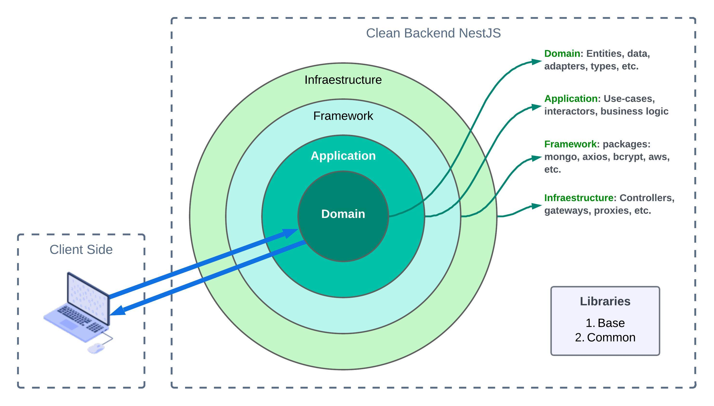
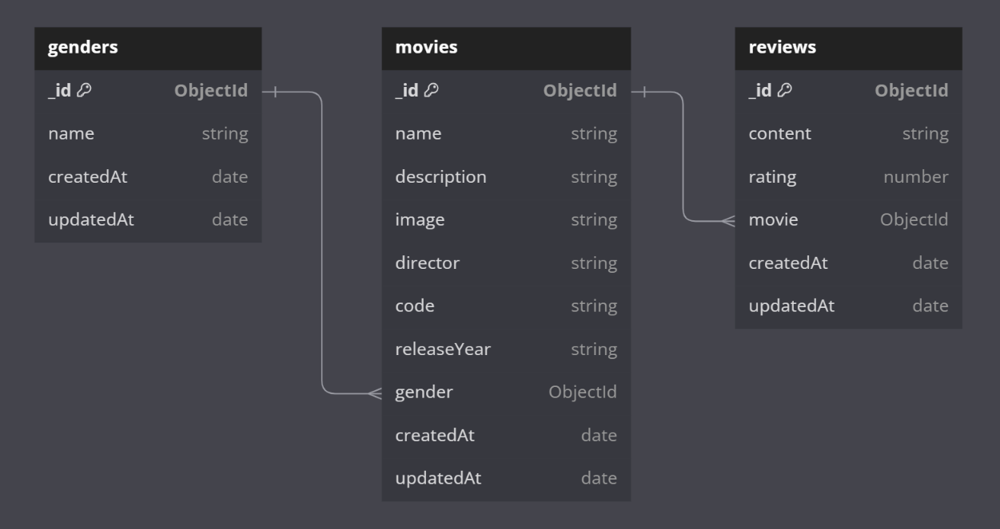

# Clean Architecture con NestJS ✨

Gabriel Barrera

Una **Clean Architecture** o arquitectura limpia es un enfoque de diseño de software que busca crear aplicaciones que sean más mantenibles y escalables. Este concepto, popularizado por **Robert C. Martin**, se centra en la separación de responsabilidades y la independencia de las capas de la aplicación, lo que permite que los cambios en una parte del sistema no afecten a otras.

Un ejemplo visual de cómo se reparten estas capas:



## **Capas de la arquitectura** 💯

Comenzaremos desde las capas internas hasta las externas.

- **Capa de dominio:** En esta capa se encuentran todas las reglas de negocio manifestadas como interfaces, entidades, tipos y clases abstractas.
- **Capa de aplicación:** En esta capa se encuentran los casos de uso o interactors con la lógica de negocio implementando las interfaces encontradas en la capa de dominio.
- **Capa de framework:** Esta capa se refiere a los paquetes y bibliotecas que se instalan dentro del proyecto que pueden ser propensos a cambiar con el tiempo, por ejemplo, si se instala el paquete `bcrypt` y pensamos en que este podría ser reemplazado en el futuro, se debe agregar un adaptador en la capa de dominio y luego agregar un repositorio que implemente esa clase abstracta para poder crear los diferentes métodos que interactúan con la biblioteca.
- **Capa de infraestructura:** Esta capa es la última y la que tiene un conocimiento completo de todo lo encontrado en las capas inferiores. En esta, se crean los controladores de tipo REST.

## Principios ☑️

- **Regla de Dependencia**: Las capas más internas (entidades y casos de uso) no deben conocer nada sobre las capas exteriores (infraestructura y frameworks). Esto asegura que la lógica de negocio permanezca intacta a pesar de los cambios en la tecnología utilizada.
- **Independencia de la Interfaz de Usuario y la Base de Datos**: La arquitectura permite que la interfaz de usuario y las bases de datos cambien sin afectar a la lógica de negocio, lo que facilita la evolución de la aplicación.

## **Ventajas de la Clean Architecture** 🚀

- **Mantenibilidad**: La separación de responsabilidades facilita el mantenimiento y la evolución de la aplicación a lo largo del tiempo.
- **Escalabilidad**: Permite agregar nuevas funcionalidades sin complicar la estructura existente.
- **Testabilidad**: Cada componente puede ser probado de manera independiente, lo que mejora la calidad del software.

## Inyección de dependencias 💉

La inyección de dependencias es un **patrón de diseño** que permite gestionar las dependencias entre diferentes componentes de una aplicación de manera más eficiente. En lugar de que un objeto (o clase) se encargue de crear o buscar sus propias dependencias, estas se "inyectan" desde el exterior.

En NestJS este principio está muy marcado; debido a esto su estructura es modular y permite tener todo bien definido sin necesidad de preocuparnos por nada más.

## Consideraciones 📒

Es necesario considerar tener lo siguiente:

```
nodejs          ^v18.19.1     
yarn            ^1.22.19      $ npm install -g yarn
nest-cli        ^10.3.2       $ npm install -g nest-cli
plop (general)  2.7.6         $ npm install -g plop@2.7.6
mongo           ^5.0
```

## **Instalación** 🛠️

```bash
$ yarn install
# En caso de error intentar ejecutar el siguiente comando
$ PUPPETEER_SKIP_CHROMIUM_DOWNLOAD=true yarn install
```

## Correr la aplicación de NestJS 🏃🏻

```bash
# en modo desarrollo
$ yarn start

# en modo observador
$ yarn start:dev

# en modo producción
$ yarn start:prod
```

## Generador de boilerplate 🧑🏻‍💻

Para poder generar un CRUD completo fácilmente sin necesidad de crear toda la estructura en las carpetas puedes ejecutar el siguiente comando:

```bash
$ yarn generate
```

Y sigue las instrucciones para generar el código...

**NOTA:** es importante que tengas el paquete `plop` de npm instalado globalmente en la versión `2.7.6` estrictamente. Si no lo tienes, intenta ir a [Consideraciones 📒](https://www.notion.so/Consideraciones-a2aff26f1eaf40d4a8fe616fcddcf688?pvs=21) para instalarlo.

## Manos a la obra 🔥

Vamos a crear una pequeña aplicación muy sencilla para crear reseñas de películas. El objetivo principal es tener una aplicación que permita crear registros de películas a partir de varios géneros cinematográficos y que pueden recibir múltiples reseñas.

### Diagrama de base de datos 📚

La siguiente es la estructura de los datos para este pequeño proyecto:



### Funcionalidad requerida 💻

1. CRUD de los géneros cinematográficos ✅
    1. No se permite eliminar un género si está siendo usado por una película
2. CRUD de películas ✅
    1. No se puede editar el código de película
    2. Al eliminar una película, si tiene reseñas, eliminarlas también
    3. Permitir filtrar por género y por nombre
3. CRUD de reseñas ✅
    1. Al editar la reseña solo permitir modificar la puntuación y el contenido
    2. El listado de reseñas filtrarlo por película